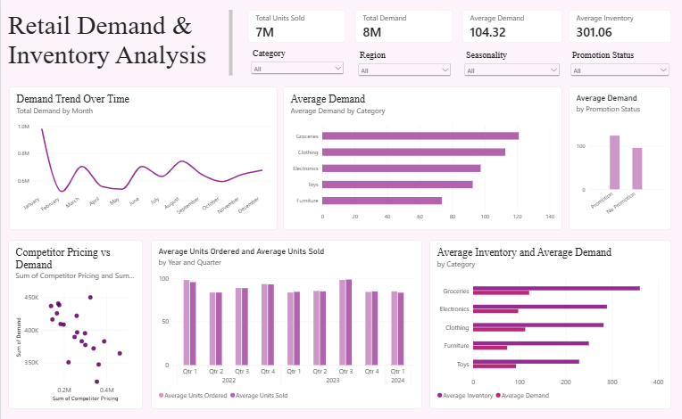
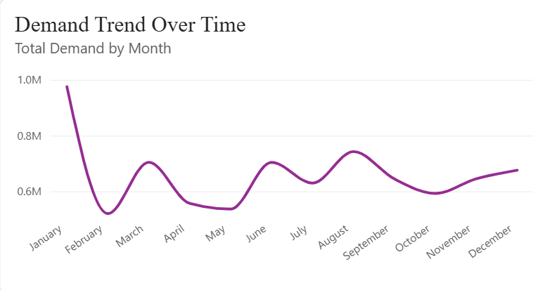
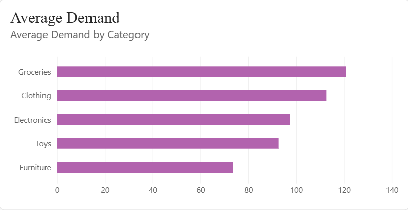
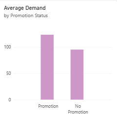
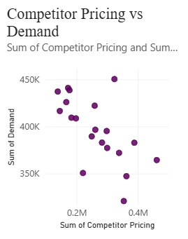
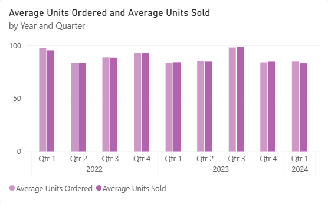
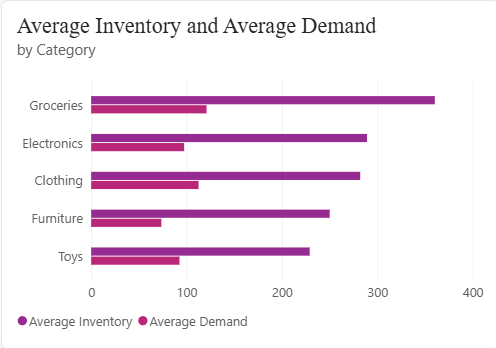

# Retail Demand & Inventory Analysis

## Project Summary

This project analyzes retail demand and inventory patterns to understand how product categories, promotions, competitor pricing, and seasonal demand affect retail performance.

The goal is to identify demand and inventory gaps and provide data-driven recommendations that can help improve inventory planning, replenishment decisions, and demand management.

## Problem Statement

Retail businesses face challenges in maintaining the right inventory levels as customer demand varies across products, seasons, promotions, and market conditions. This analysis aims to identify demand patterns and inventory gaps to help businesses better align inventory levels with actual demand and reduce the risk of overstocking and understocking.

## Dataset Overview

The dataset used in this project is the **Retail Store Inventory and Demand Forecasting** dataset sourced from Kaggle. The dataset contains retail inventory and demand-related information that can be used to analyze product demand, inventory levels, sales activity, ordering patterns, promotions, competitor pricing, and time-based trends.

[Retail Store Inventory and Demand Forecasting - Kaggle](https://www.kaggle.com/datasets/atomicd/retail-store-inventory-and-demand-forecasting)

## Methodology

This project used an exploratory data analysis approach to understand patterns and relationships within the retail dataset.

Dataset Familiarization – Reviewed the dataset to understand its variables, categories, and the information available for analysis.
Data Analysis – Analyzed demand, inventory, product categories, promotion status, time periods, and competitor pricing to identify relevant patterns and relationships.
Dashboard Development – Created the necessary measures and visualizations in Power BI, including KPI cards, charts, and slicers.

## Key Analysis & Visualization

### 1. Demand Trend Over Time

The demand trend shows significant changes throughout the year. Demand starts at a high level in January, decreases in February, and then increases again in March. Additional increases can be observed around June and August, followed by a decline toward October and a gradual increase toward December. This shows that demand is not constant throughout the year and that seasonal patterns should be considered when planning inventory and replenishment.

### 2. Average Demand by Category

Groceries have the highest average demand among the five categories, followed by Clothing and Electronics. Toys and Furniture have lower average demand compared with the other categories. This suggests that inventory planning should consider category-level demand rather than applying the same inventory strategy across all product categories.

### 3. Average Demand by Promotion Status

The dashboard shows higher average demand during promotion periods compared with periods without promotions. This indicates that promotional activities are associated with higher demand in the dataset and should be considered when preparing inventory for promotional periods. The result shows an association rather than proving that promotions directly caused the increase in demand.

### 4. Competitor Pricing vs Demand

The scatter plot shows an overall downward pattern between competitor pricing and demand in the dataset. Higher competitor pricing values are generally associated with lower observed demand values. This suggests that competitor pricing may be an important factor to monitor when analyzing changes in customer demand. Further statistical analysis would be needed to determine whether this relationship is causal.

### 5. Average Units Ordered and Average Units Sold

Average units ordered and average units sold follow relatively similar patterns across the quarters shown. The comparison helps evaluate whether ordering activity is generally aligned with sales activity. Monitoring differences between units ordered and units sold can help identify potential opportunities to improve replenishment planning and inventory control.

### 6. Average Inventory and Average Demand

The comparison shows that inventory levels vary across product categories. Groceries have the highest average inventory as well as the highest average demand, while lower-demand categories also maintain considerable inventory levels. This highlights the importance of reviewing inventory allocation based on actual demand to reduce the risk of excess inventory while maintaining product availability.

## Recommendations

Based on the analysis, the following recommendations are proposed:

1. **Prioritize high-demand categories**

   Inventory planning should give greater attention to high-demand categories such as Groceries, Clothing, and Electronics to ensure that stock levels can support customer demand.

2. **Align inventory with category demand**

   Inventory levels should be reviewed at the category level instead of applying a uniform inventory strategy. Categories with lower demand should be evaluated for potential excess inventory.

3. **Incorporate seasonal demand patterns**

   Historical monthly and quarterly demand patterns should be considered when planning inventory and replenishment. Higher-demand periods should be anticipated to reduce the risk of stock shortages.

4. **Prepare inventory for promotional periods**

   Since average demand is higher during promotion periods in the dataset, inventory requirements should be reviewed before promotional campaigns to ensure sufficient product availability.

## Tools Used

- **Power BI** - Data transformation, analysis, visualization, and dashboard development
- **Excel** - Data review and validation
- **GitHub** - Project documentation and portfolio presentation

## References

- [Retail Store Inventory and Demand Forecasting Dataset - Kaggle](https://www.kaggle.com/datasets/atomicd/retail-store-inventory-and-demand-forecasting)
- [Perishable Goods Management Analysis - GitHub](https://github.com/urbizandrea/Perishable_Goods_Management_Analysis)
